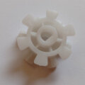
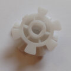
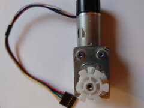
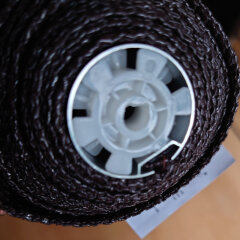
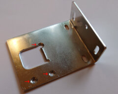
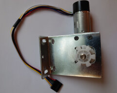
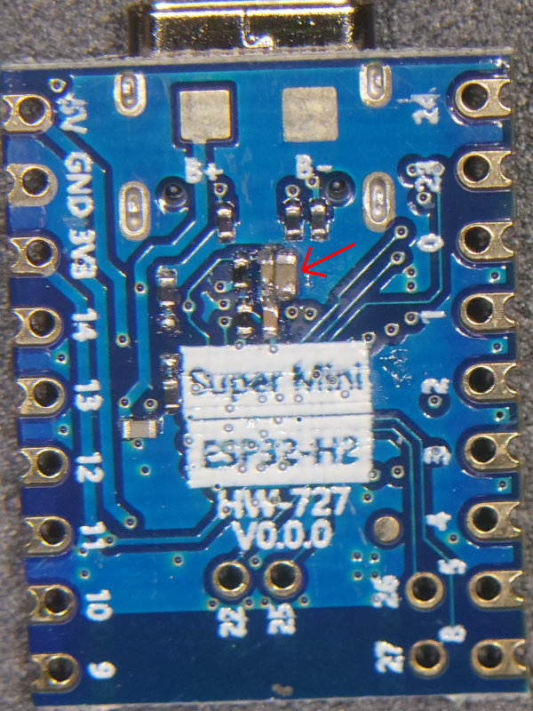
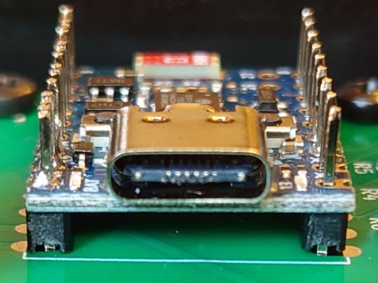
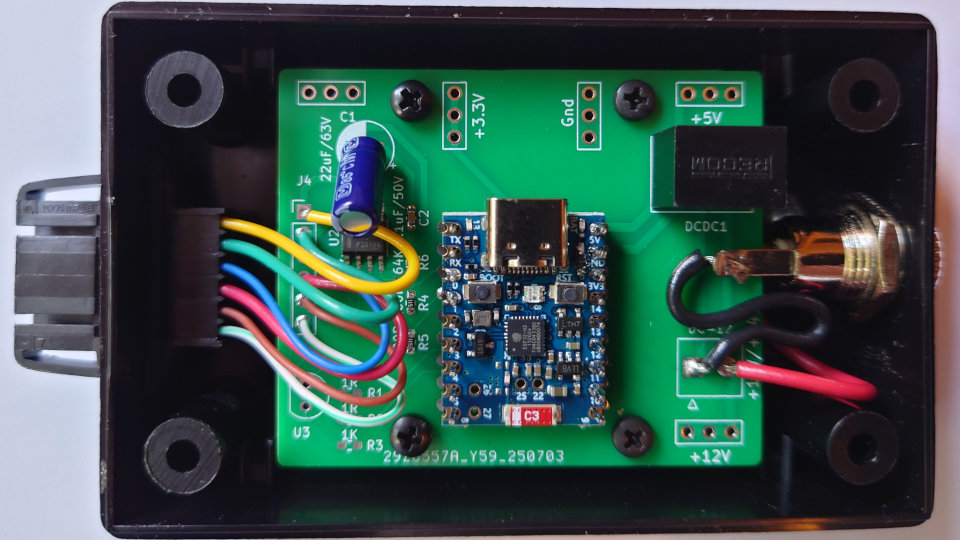
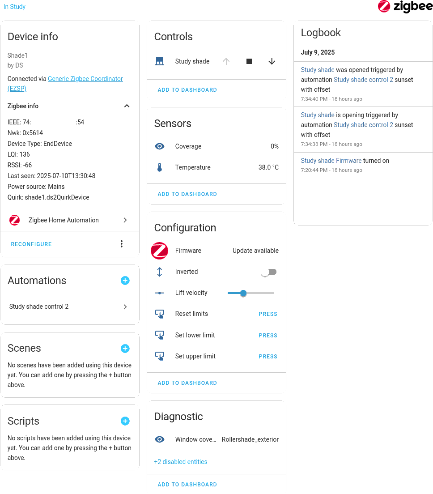

# esp32-zigbee-shade

## Overview

This external window shade is designed to shield the room from sunlight, reducing the load on the air conditioner. I upgraded a basic corded roller shade by integrating a small DC motor and a Zigbee controller compatible with my Home Assistant network.

## Firmware

The firmware is written in C and built using `idf.py`.
It exposes 2 endpoints with 3 clusters:

* **Window covering** (shade control)
* **OTA** (remote firmware upgrade)
* **Temperature measurement** (on-chip temperature sensor)

The temperature sensor reports via Zigbee to monitor the temperature inside the control box, as summer ambient temperatures often exceed 35°C, and the enclosure tightly houses both the ESP32 and the motor driver.

## Hardware

### Mechanical

This window cover is based on the VICLLAX 5×6 ft corded roll-up shade, which uses an aluminum tube with a 1 1/8" (28 mm) inner diameter.

Several inexpensive DC motors with pre-assembled gearheads are available online, commonly found as clones of the Bringsmart High Torque Worm Gear DC motor. Most of these motors use gearheads with D-shaped shafts, predominantly 8 mm but occasionally 6 mm.

These motors and gearboxes come in various voltages and torque ratings. I used a 12 V motor equipped with a 200× ratio gearbox rated for 4 kg·cm torque. This choice turned out to be excessive, as a gearbox with a 60× or 80× ratio would have been sufficient.

To couple the motor to the roller tube, I repurposed Zemismart’s replacement 28 mm nylon gears, removing one tooth from each side and filing the D-shaped channel to match the motor shaft.


\
*The original gear compared to the modified gear (two teeth removed, D-shape filed).*

\
*Gear mounted on the motor shaft.*

\
*Gear inserted into the shade tube.*

For motor mounting, I modified the original bracket supplied with the shade. I broke off the support lip, drilled two additional holes, and added a countersunk hole at the existing cut. The modified bracket is shown below:



The image below shows the fully assembled motor with the coupling gear:



### Electronics

The control system uses an ESP32-H2 chip on Tenstar’s Supermini board (or a clone). [This board sometimes exhibits startup issues](https://github.com/David-EIPI/esp32-zigbee-light) when powered from a standalone DC-DC converter. Although the board already has an RC circuit on its reset line, it is apparently insufficient, as intermittent boot failures occur on power-up. I resolved this issue by soldering an additional 0.22 µF capacitor in parallel with the existing one.

The ESP32-H2 Supermini clones available on Aliexpress vary. The most notable difference is component placement: some boards have all components mounted on the top side, while other (usually cheaper) versions have components on both sides. For the double-sided boards, the additional capacitor should be soldered on the bottom side, as shown in the photo. Although I only had 0603-sized capacitors at hand, it fit comfortably next to the existing one.



Due to bottom-side components, the ESP32-H2 board must be mounted above the mainboard:



The motor driver uses a DRV8871 chip from Texas Instruments. It accepts a PWM control signal, easily generated using the standard ESP32 `ledc` controller.

The motor features a rotary encoder interfaced to the ESP32’s standard pulse-counter controller. This encoder maintains consistent upper and lower travel limits and allows precise partially-open positioning of the shade.

A notable drawback of this motor is its hardwired, non-weatherproof cable. Its durability in summer humidity remains uncertain, and some corrosion is likely inevitable. To minimize electrochemical corrosion, I designed the control circuit to disconnect power from the motor and encoder when the shade is stationary.

The final assembly fits neatly into the Serpac 110i BK enclosure. I only needed to cut openings for the 6-pin motor connector (on the left) and the power jack (on the right):



Since the motor connector is not polarized it may be a good idea to mark the connector orientation on the enclosure side.

## ZHA quirk

Although ZHA supports window coverings, additional configuration using a quirk is required. The quirk provides coverage percentage display, lift velocity settings, and essential calibration buttons for setting upper and lower limits.

The screenshot below shows the device page (quirk applied):



Calibration of limits must be completed before using the shade for the first time. The calibration procedure is as follows:

* Press "↓" to start lowering the shade, stopping roughly halfway.
  This step isn't strictly required, but it reduces the likelihood of pulse counter overflow, as the pulse counter range is limited to 16 bits.
* Press "reset limits".
* Press "↑" to raise the shade, stopping at the desired upper position. Then press "Set upper limit" to record this position.
* Press "↓" again, stopping at the desired lower position. Then press "Set lower limit" to record this position.

Depending on Zigbee network topology, commands may take about a second to process. Thus, if the motor rolls quickly, reducing the lift velocity before calibration may improve accuracy.

## Over-the-air (OTA) upgrade

The firmware supports OTA upgrades. ESP's Zigbee library handles most tasks, leaving only four essential `esp_ota_*` function calls (`begin`, `data`, `write`, and `end`) for firmware implementation, aside from cluster allocation and error checking. The SDK provides an image builder tool (`image_builder_tool.py`) to convert compiled firmware into OTA format (see the `ota_image.sh` script for a usage example).

On the Home Assistant side, the Zigpy configuration should be added to `configuration.yaml` under the `zha:` section, as illustrated below:

```
zha:
  zigpy_config:
    ota:
      extra_providers:
        - type: zigpy_local
          index_file: /config/zha_ota/local_index.json
        - type: advanced
          warning: I understand I can *destroy* my devices by enabling OTA
              updates from files. Some OTA updates can be mistakenly applied to the
              wrong device, breaking it. I am consciously using this at my own risk.
          path: /config/zha_ota
```

OTA update files (JSON and BIN) should be uploaded to the specified directory (`/config/zha_ota` in this example). When using the JSON OTA provider, Home Assistant will display firmware version and release notes from the provided JSON file.

